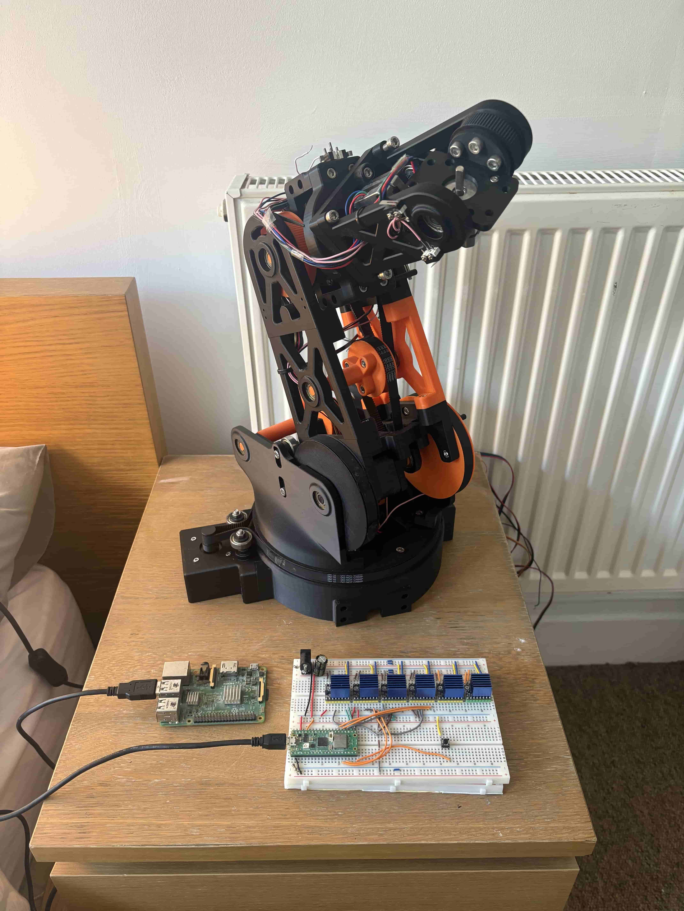

# **Lucas Bryan**

### Robotics Engineer | Automation, Robotics, Electronics & Software

---

## About

  

I’m an engineering student who specialises in robotics, in the intersection of mechanical design and software control. Over the last few years, I have transitioned from academic theory into complex hands-on development, working with everything from ROS2 and custom circuit assemblies to deep learning models. My professional priority is to build intelligent, reactive hardware that bridges the gap between digital theory and real-world success.

---

## Projects

### [Six DOF Arm with Adaptive Pick and Place through OpenCV](no-link-rn)

> **Tech Stack:** Parametric modelling / ROS / Python / Machine Learning

### Overview

* Design, build, and simulation of a six DOF robotic arm focused on high kinematic accuracy and weight reduction. I developed the entire stack, from 3D modelling in Fusion 360, 3D printing from scratch, custom circuit setups for power distribution and motor control, to simulation in ROS2/Gazebo with Python. 

  * NEMA 17 motors used, with belt driven gear reductions to save weight and reduce costs. Open loop control implented.

### Challenges
* Power management was troublesome, with six NEMA 17 motors, power draw is in the 150-200W range depending on arm load. I solved this by writing an adaptive power management script to iteratively reduce the power that each motor needs to run at full capacity. Reduction of power use by ~34% increasing overall load capacity.

* Reduction of weight while maintaining strength under load. Solved through iterative design using FEA tools to optimise part infill percent.

### Goal & Future work
* Adaptive pick and place implementation through OpenCV. Current development focuses on an interactive control panel to speed up development.

  
  

### [Leadership & Systems Engineer | Solar-Integrated Power System & Drivetrain](no-link-rn)

> **Tech Stack:** MATLAB & Simulink / Perturb & Observe (P&O) MPPT / Fusion 360 FEA / BLDC Control / System block diagram design

### Overview

* d

### Challenges
* d

  
  

### [SLAM Monocular Depth Mapper using MDE Models & ROS](no-link-rn)

> **Tech Stack:** 

### Overview

* d

### Challenges
* d

  

### [Automated Productitivy Manager](no-link-rn)

> **Tech Stack:** 

### Overview

* d

### Challenges
* d

## Experience & Research

### [Royal Mint | 17th Century Manufacturing Research Project](no-link-rn)
> **Tech Stack:** 

### Overview

* d

### Challenges
* d

---

## Skills & Tools

* d

---

## Me

* **Me:**
* **Hobbies:**

  
  

---
