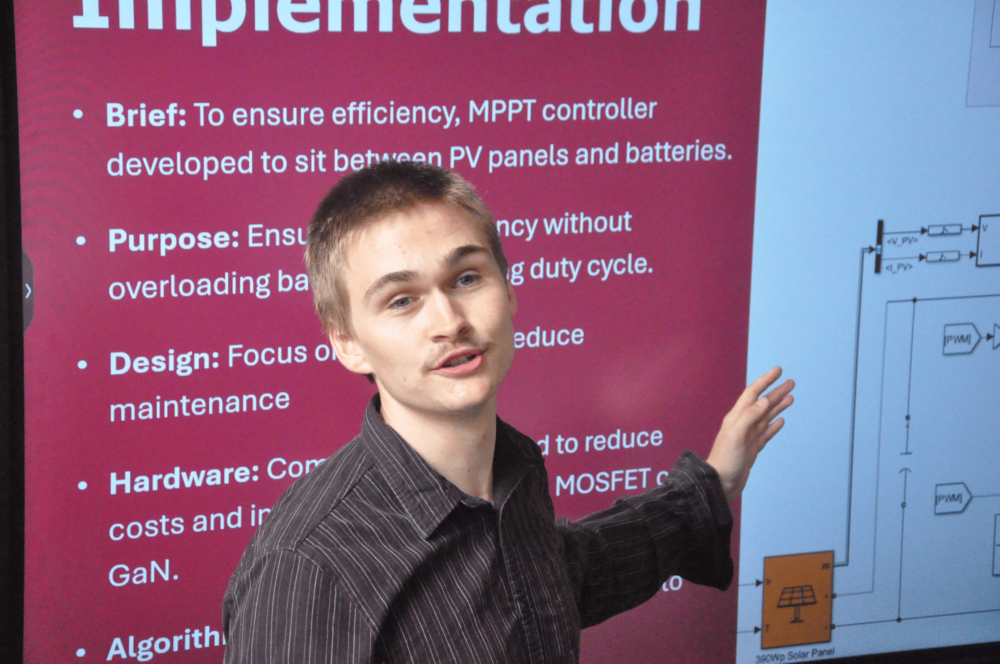
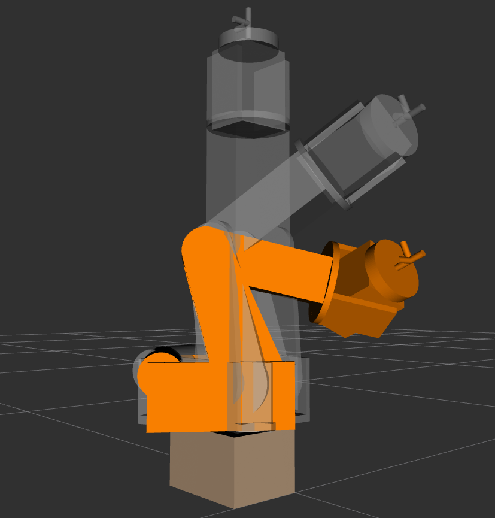
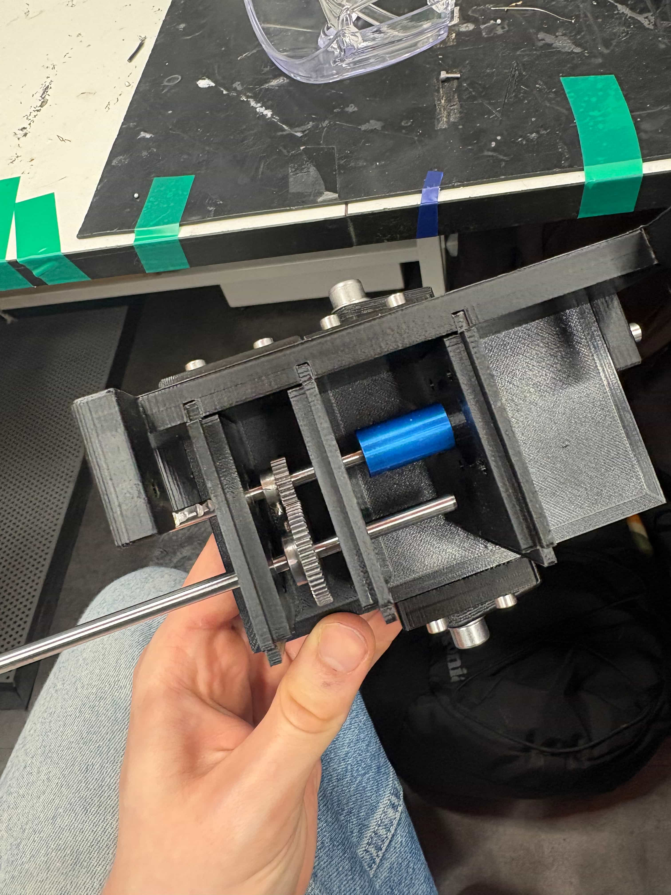
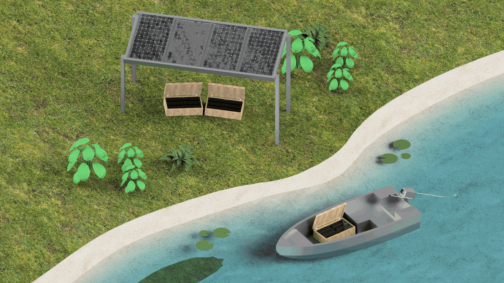
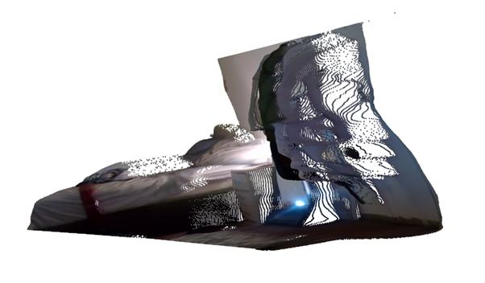
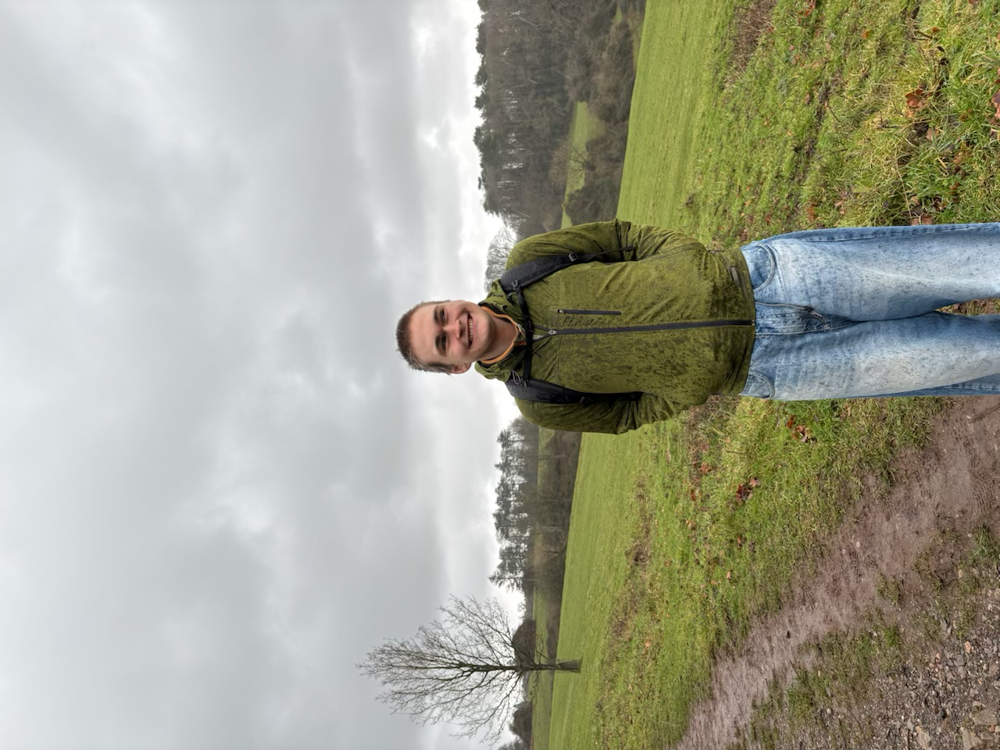
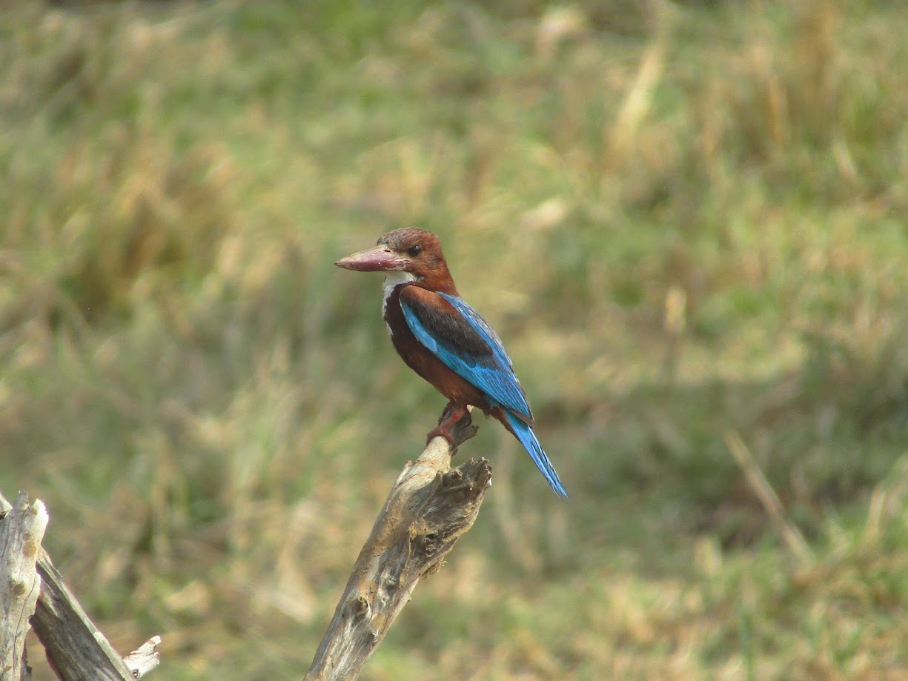

# **Lucas Bryan**

### Robotics Engineer | Automation, Robotics, Electronics & Software

---

## About

  
  <figcaption><i>Me giving my pitch to an academic board on applications of solar vehicles in remote regions of the Amazon</i></figcaption>

I’m an engineering student who specialises in robotics, in the intersection of mechanical design and software control. Over the last few years, I have transitioned from academic theory into complex hands-on development, working with everything from ROS2 and custom circuit assemblies to deep learning models. My professional priority is to build intelligent, reactive hardware that bridges the gap between digital theory and real-world success.

---

## Projects

### [Six DOF Arm with Adaptive Pick and Place through OpenCV | Current Project](https://github.com/lucasmbry/Portfolio)

> **Tech Stack:** Parametric modelling / ROS / Python / Machine Learning

### Overview

* Design, build, and simulation of a six DOF robotic arm focused on high kinematic accuracy and weight reduction. I developed the entire stack, from 3D modelling in Fusion 360, 3D printing from scratch, custom circuit setups for power distribution and motor control, to simulation in ROS2/Gazebo with Python. 

  * NEMA 17 motors used, with belt driven gear reductions to save weight and reduce costs. Open loop control implemented.

### Challenges
* Power management was troublesome, with six NEMA 17 motors, power draw is in the 150-200W range depending on arm load. I solved this by writing an adaptive power management script to iteratively reduce the power that each motor needs to run at full capacity. Reduction of power use by ~34% increasing overall load capacity.

* Reduction of weight while maintaining strength under load. Solved through iterative design using FEA tools to optimise part infill percent.

### Goal & Future work
* Adaptive pick and place implementation through OpenCV. Current development focuses on an interactive control panel to speed up development.

  
  
  <figcaption><i>Left: Constructed Robot, Right: ROS simulation of simplified URDF</i></figcaption>

### [Leadership & Systems | Solar-Integrated Power System & Drivetrain](https://github.com/lucasmbry/Portfolio)

> **Tech Stack:** MATLAB & Simulink / Perturb & Observe (P&O) MPPT / Fusion 360 FEA / BLDC Control / System block diagram design

 ### | Highest Grade In the Year Achieved - 81% |

### Overview

* Leadership of a six-engineer team to design a suitable solar boat electrification system to tackle energy poverty in the rural Amazon, with the goal of replacing existing gasoline powered boats for under £3000. A scale model for presentation was also developed.

* My key role involved heavy project management alongside being the lead system engineer. My focus was on implementation of a custom MPPT synchronous buck converter from scratch using a modified Perturb & Observe algorithm. This system was tied in with a BLDC drivetrain and reached a max efficiency of 96%.

* Through this project I mastered closed-loop PI control integration and gained practical experience generating industry standard project packages (Gantt charts, BOMs, GA drawings). All of this was done while balancing strict social and economic factors to ensure a successful system.

### Challenges
* Remote nature of project meant strict economic restraints had to be imposed to ensure local affordability.

* System integration among a team of six was rigorous. I learnt many social and team management skills during this project.

  
  
  <figcaption><i>Left: Scale model drivetrain, Right: Render of our proposed design</i></figcaption>

### [SLAM Monocular Depth Mapper using MDE Models & ROS](https://github.com/lucasmbry/Portfolio)

> **Tech Stack:** ROS2, Python, C++, Linux, PyTorch, CUDA, OpenCV, MDE models (Depth Anything, MiDaS), Visual SLAM, RViz

### Overview

* Planar estimation alongside open-source monocular depth estimation models for environment reconstruction using ROS2 and simple RGB camera. Linux heavy workflow.

* Low latency streaming through GStreamer from a remotely controlled robotic test bed with RPi 3B+.

### Challenges
* Scale correction was difficult, and still something I would like to improve in the future. My current method involved fitting a 3D plane to the floor of each image and using known dimensions to estimate scale.

  
  <figcaption><i>Point cloud created with depth mapping algorithm using standard monocular RGB camera</i></figcaption>

### [Automated Productivity Manager](https://github.com/lucasmbry/Portfolio)

> **Tech Stack:** Python, SQLite, Google API, Cron

### Overview

* Automated calendar manager to streamline personal task prioritisation. I place all my tasks into a to-do list, in which all are automatically scheduled into my calendar, taking into account personal requirements.
* Everything is done through API calls and outputs to a small 640p screen on my desk. Has been influential in speeding up and optimising my work.

## Experience & Research

### [Royal Mint | 17th Century Manufacturing Research Project](https://github.com/lucasmbry/Portfolio)
> **Tech Stack:** Academic research / Professional development / Manufacturing

### Overview

* Conducted group research and technical analysis to rediscover a previously lost 17th century coin production method in conjunction with the royal mint.
* Presentation of technical results alongside demonstration of working model to a professional panel.

---

## Skills & Tools

* **Software & Version Control:** Fusion 360, FEA, MATLAB, Simulink, Python (NumPy, Pandas), KiCAD, C/C++, Linux/Bash, Git/GitHub, OpenCV, PyTorch, CUDA, SQLite, API integration

* **Robotics & Automation:** ROS/2, Gazebo, Machine Learning, Monocular Depth Estimation, Kinematics, SLAM, Microcontrollers (Arduino, ESP32, RPi, F28379D, Ti Launchpad), Sensor integration, RViz, GStreamer, Parametric modelling

* **Power Systems & Hardware:** MPPT Control design, Buck Converters, Battery sizing, DC-DC conversion, Circuit Assembly, Environment recreation, BLDC motor control, PID control

* **Engineering Design & Management:** Gantt Chart, Team Leadership, Rapid Prototyping, Bill of Materials, PDS, FMECA Risk Analysis, Design for SDGs, Technical documentation, data sheet analysis, Complex concept communication, Cross function teamwork, English Fluency

---

## About me

 I’m an avid climber and long-distance hiker, currently training for an 11-day 170km through hike along the Tour du Mont Blanc. I always bring my camera to shoot wildlife, recently obsessed with bird photography. If you want to chat about my work, and what I can provide, please drop me a message.

  
  
  <figcaption><i>Left: Me on a hike!, Right: White throated kingfisher I spotted in Sri Lanka</i></figcaption>

---

